第3章 一般化線形モデル(GLM)
===========================

.. code:: python

    import pandas
    
    src = "http://hosho.ees.hokudai.ac.jp/~kubo/stat/iwanamibook/fig/poisson/data3a.csv"
    
    def fetch_data(src):
        return pandas.read_csv(src)

.. parsed-literal::

    /home/youki/.virtualenvs/apple/local/lib/python2.7/site-packages/pytz/__init__.py:31: UserWarning: Module readline was already imported from /home/youki/.virtualenvs/apple/lib/python2.7/lib-dynload/readline.x86_64-linux-gnu.so, but /home/youki/.virtualenvs/apple/lib/python2.7/site-packages is being added to sys.path
      from pkg_resources import resource_stream

.. code:: python

    def setLimit(endog):
        (m, M) = endog.min(), endog.max()
        delta = (M - m)/25.
        ylim(m-delta, M+delta)
        return
3.4 ポアソン回帰の統計モデル
----------------------------

図3.2

.. code:: python

    def draw_fig_3_2():
        """
        図3.2を描画する関数
        """
        df = fetch_data(src)
        scatterPlot(df, 'y', 'x', 'f')
        return
    
    def scatterPlot(df, name_y, name_x, name_c):
        """
        matplotlibを用いたScatterPlotのようなもの
        """
        catg = df[name_c].unique()
        data = [df[df[name_c] == c][[name_y, name_x]] for c in catg]
        syms = ['ko', 'wo']
        for i in xrange(len(catg)):
            plot(data[i][name_x], data[i][name_y], syms[i],label=catg[i])
        setLimit(df['y'])
        legend(loc='upper left')
        return
.. code:: python

    figure(figsize(8, 7))
    draw_fig_3_2()
    plt.show()

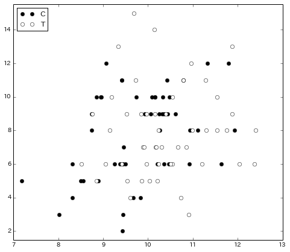

図3.3

.. code:: python

    def draw_fig_3_3():
        """
        図3.3を描画する関数
        """
        df = fetch_data(src)
        drawBoxPlot(df, 'y', 'f')
        return
        
    def drawBoxPlot(df, name_endog, name_catg):
        """
        matplotlibの箱ヒゲ図作成関数のラッパー関数
        """
        catg = df[name_catg].unique()
        data = [df[name_endog][df[name_catg] == c] for c in catg]
        setBoxColors(boxplot(data, sym='ow', widths=0.8))
        xticks(1+arange(len(catg)), catg)
        setLimit(df[name_endog])
        return
    
    def setBoxColors(bp, C='k', L=['boxes', 'caps', 'whiskers', 'medians']):
        """
        箱ヒゲ図のカラーリングを久保本に合わせる
        """
        [[setp(bp[e][i], color=C) for i in xrange(len(bp[e]))] for e in L]
        return
.. code:: python

    figure(figsize(8, 7))
    draw_fig_3_3()
    plt.show()

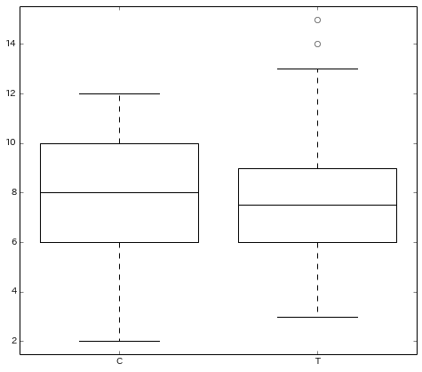

図3.4

.. code:: python

    import numpy
    
    def draw_fig_3_4():
        # プロット
        N = 2
        b1 = [-1, -2]
        b2 = [0.4, -0.8]
        ss = ['k-', 'k--']
        xx = numpy.linspace(-4, 5, 1000)
        [plot(xx, np.exp(b1[i] + b2[i] * xx), ss[i]) for i in xrange(N)]
    
        # ラベリング
        text(-3, 2.5, r"$\{\beta_1, \beta_2\} = \{-2, 0.8\}$", fontsize=15)
        text(2, 2.5, r"$\{\beta_1, \beta_2\} = \{-1, 0.4\}$", fontsize=15)
        ylabel(u"個体$i$の$\lambda_i$", fontsize=15)
        xlabel(u"個体$i$の体サイズ$x_i$", fontsize=15)
    
        # 描画範囲の設定
        ylim(0., 2.7)
        xlim(-4, 5.0)
        return
.. code:: python

    figure(figsize(8, 7))
    draw_fig_3_4()
    plt.show()

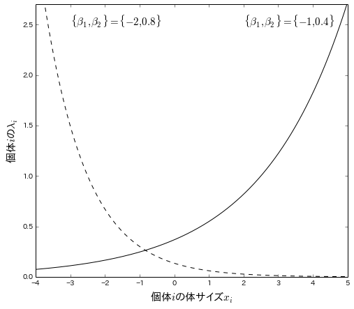

pp. 58

.. code:: python

    import statsmodels.api as sm
    from statsmodels.formula.api import glm
    
    def get_mdl_1():
        # データ解析のための統計モデリング入門 pp.58
        """
        In the book,
        Intercept: 1.29172
        x: 0.07566
        LogLik: -235.3863 (df=2)
        """
        df = fetch_data(src)
        mdl = glm('y ~ x', data=df, family=sm.families.Poisson(sm.families.links.log)).fit()
        print mdl.summary()
        return mdl
    
    mdl_1 = get_mdl_1()

.. parsed-literal::

                     Generalized Linear Model Regression Results                  
    ==============================================================================
    Dep. Variable:                      y   No. Observations:                  100
    Model:                            GLM   Df Residuals:                       98
    Model Family:                 Poisson   Df Model:                            1
    Link Function:                    log   Scale:                             1.0
    Method:                          IRLS   Log-Likelihood:                -235.39
    Date:                Sun, 20 Oct 2013   Deviance:                       84.993
    Time:                        20:30:14   Pearson chi2:                     83.8
    No. Iterations:                     6                                         
    ==============================================================================
                     coef    std err          t      P>|t|      [95.0% Conf. Int.]
    ------------------------------------------------------------------------------
    Intercept      1.2917      0.364      3.552      0.000         0.579     2.005
    x              0.0757      0.036      2.125      0.034         0.006     0.145
    ==============================================================================

図3.7

.. code:: python

    def draw_fitted_val(mdl):
        xx = np.linspace(7, 13, 1000)
        yy = mdl.predict({'x':xx})
        plot(xx, yy, 'k-')
        return
        
    def draw_fig_3_7(mdl):
        draw_fig_3_2()
        draw_fitted_val(mdl)
        return
.. code:: python

    figure(figsize(8, 7))
    draw_fig_3_7(mdl_1)
    plt.show()

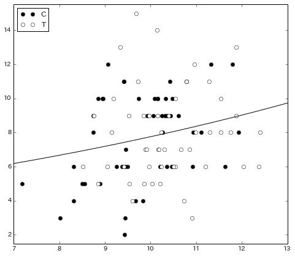

モデル評価 (Not in the book)

.. code:: python

    def my_qqplot(model):
        # Q-Q Plot
        resid = model.resid_pearson
        sm.graphics.qqplot(resid, fit=True, line='r')
    
    def my_fit_vs_res(model):
        # fitted vs. residual Plot
        resid = model.resid_pearson
        scatter(model.mu, resid)
        hlines(0, model.mu.min(), model.mu.max())
        ylabel('Pearson Residuals')
        xlabel('Fitted values')
        grid()
.. code:: python

    figure(figsize(6, 6))
    my_qqplot(mdl_1)
    plt.show()

.. parsed-literal::

    <matplotlib.figure.Figure at 0x513fb50>

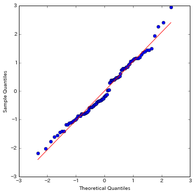

.. code:: python

    figure(figsize(6, 6))
    my_fit_vs_res(mdl_1)
    plt.show()

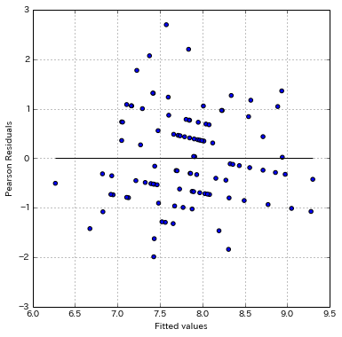

.. code:: python

    # fitted vs. residual Plot
    fig = plt.figure(figsize=(12,8))
    fig = sm.graphics.plot_partregress_grid(mdl_1, fig=fig)

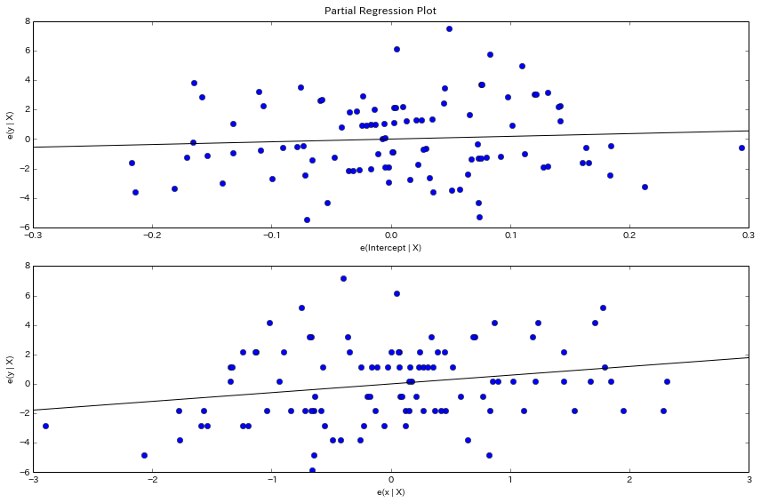

3.5 説明変数が因子型の統計モデル
--------------------------------

.. code:: python

    import statsmodels.api as sm
    from statsmodels.formula.api import glm
    
    def get_mdl_2():
        # データ解析のための統計モデリング入門 pp.58
        """
        In the book,
        Intercept: 2.05156
        fT: 0.01277
        LogLik: -237.6273 (df=2)
        """
        df = fetch_data(src)
        mdl = glm('y ~ f', data=df, family=sm.families.Poisson(sm.families.links.log)).fit()
        print mdl.summary()
        return mdl
    
    mdl_2 = get_mdl_2()

.. parsed-literal::

                     Generalized Linear Model Regression Results                  
    ==============================================================================
    Dep. Variable:                      y   No. Observations:                  100
    Model:                            GLM   Df Residuals:                       98
    Model Family:                 Poisson   Df Model:                            1
    Link Function:                    log   Scale:                             1.0
    Method:                          IRLS   Log-Likelihood:                -237.63
    Date:                Sun, 20 Oct 2013   Deviance:                       89.475
    Time:                        20:30:38   Pearson chi2:                     87.1
    No. Iterations:                     6                                         
    ==============================================================================
                     coef    std err          t      P>|t|      [95.0% Conf. Int.]
    ------------------------------------------------------------------------------
    Intercept      2.0516      0.051     40.463      0.000         1.952     2.151
    f[T.T]         0.0128      0.071      0.179      0.858        -0.127     0.153
    ==============================================================================

モデル評価 (Not in the book)

.. code:: python

    figure(figsize(6, 6))
    my_qqplot(mdl_2)
    plt.show()

.. parsed-literal::

    <matplotlib.figure.Figure at 0x4214c90>

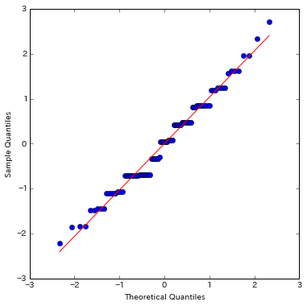

.. code:: python

    figure(figsize(6, 6))
    my_fit_vs_res(mdl_2)
    plt.show()

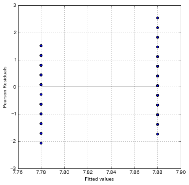

.. code:: python

    # fitted vs. residual Plot
    fig = plt.figure(figsize=(12,8))
    fig = sm.graphics.plot_partregress_grid(mdl_2, fig=fig)

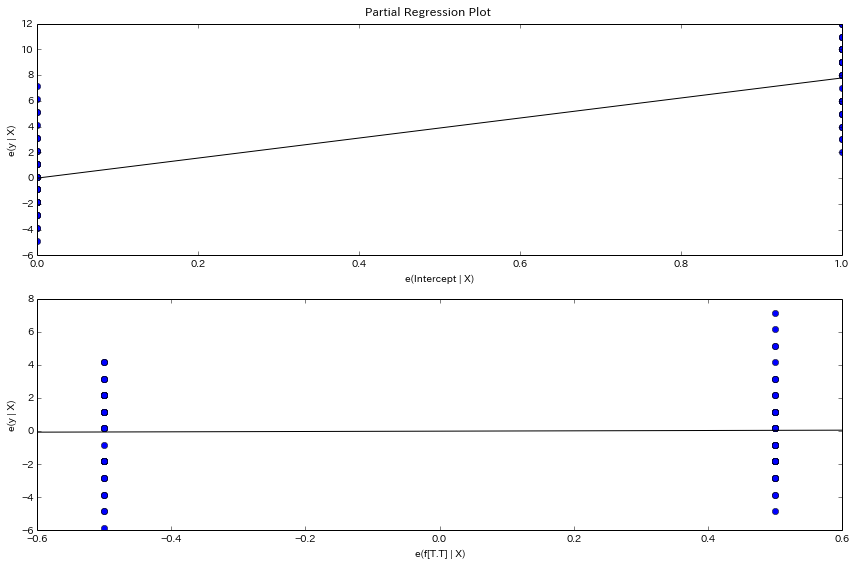

3.5 説明変数が数量型+因子型の統計モデル
---------------------------------------

.. code:: python

    import statsmodels.api as sm
    from statsmodels.formula.api import glm
    
    def get_mdl_3():
        # データ解析のための統計モデリング入門 pp.58
        """
        In the book,
        Intercept: 1.2631
        x: 0.0801
        fT: -0.0320
        LogLik: -235.2937 (df=2)
        """
        df = fetch_data(src)
        mdl = glm('y ~ x + f', data=df, family=sm.families.Poisson(sm.families.links.log)).fit()
        print mdl.summary()
        return mdl
    
    mdl_3 = get_mdl_3()

.. parsed-literal::

                     Generalized Linear Model Regression Results                  
    ==============================================================================
    Dep. Variable:                      y   No. Observations:                  100
    Model:                            GLM   Df Residuals:                       97
    Model Family:                 Poisson   Df Model:                            2
    Link Function:                    log   Scale:                             1.0
    Method:                          IRLS   Log-Likelihood:                -235.29
    Date:                Sun, 20 Oct 2013   Deviance:                       84.808
    Time:                        20:30:47   Pearson chi2:                     83.8
    No. Iterations:                     6                                         
    ==============================================================================
                     coef    std err          t      P>|t|      [95.0% Conf. Int.]
    ------------------------------------------------------------------------------
    Intercept      1.2631      0.370      3.417      0.001         0.539     1.988
    f[T.T]        -0.0320      0.074     -0.430      0.667        -0.178     0.114
    x              0.0801      0.037      2.162      0.031         0.007     0.153
    ==============================================================================

図3.8(A)

.. code:: python

    def draw_fitted_val(mdl):
        N = 1000
        xx = np.linspace(7, 13, N)
        
        data = {'x':xx, 'f':np.repeat('C', N)}
        yy = mdl.predict(data)    
        plot(xx, yy, '-', color='black')
    
        data = {'x':xx, 'f':np.repeat('T', N)}
        yy = mdl.predict(data)
        plot(xx, yy, '-', color='gray')
    
        text(7.5, 7, u"無処理", fontsize=15)
        text(12,8.3, u"施肥処理", fontsize=15)
        return
        
    def draw_fig_3_8_a(mdl):
        draw_fig_3_2()
        draw_fitted_val(mdl)
        return
.. code:: python

    figure(figsize(8, 7))
    draw_fig_3_8_a(mdl_3)
    plt.show()

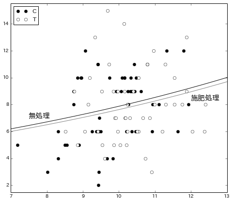

モデル評価

.. code:: python

    figure(figsize(6, 6))
    my_qqplot(mdl_3)
    plt.show()

.. parsed-literal::

    <matplotlib.figure.Figure at 0x35f8d50>

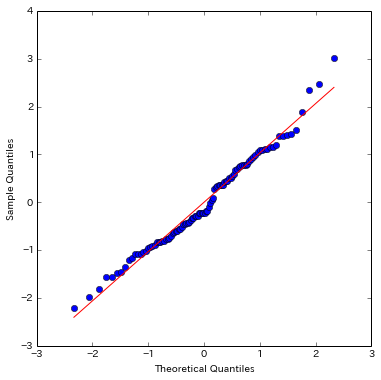

.. code:: python

    figure(figsize(6,6))
    my_fit_vs_res(mdl_3)
    plt.show()

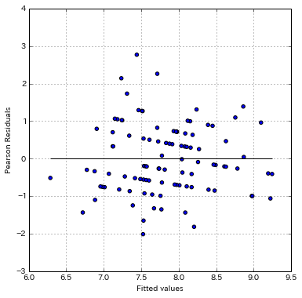

.. code:: python

    # fitted vs. residual Plot
    fig = plt.figure(figsize=(12,8))
    fig = sm.graphics.plot_partregress_grid(mdl_3, fig=fig)

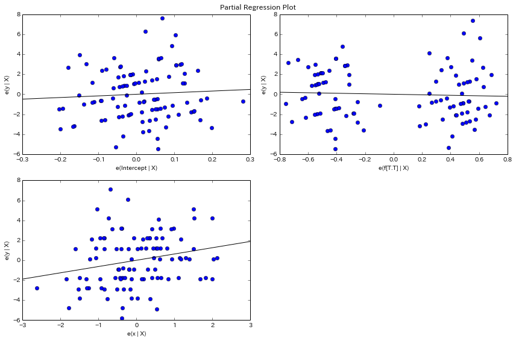

mdl\_1 から mdl\_3 までの簡易な比較

.. code:: python

    print [mdl_1.aic, mdl_2.aic, mdl_3.aic] 
    print [mdl_1.bic, mdl_2.bic, mdl_3.bic]
    print [mdl_1.null_deviance, mdl_2.null_deviance, mdl_3.null_deviance]
    print [mdl_1.df_resid, mdl_2.df_resid, mdl_3.df_resid]

.. parsed-literal::

    [474.77250153972147, 479.25451392137342, 476.58743848498739]
    [-366.31368173610463, -361.83166935445382, -361.8935746048474]
    [89.506937569580856, 89.506937569580856, 89.506937569580856]
    [98, 98, 97]

.. code:: python

    