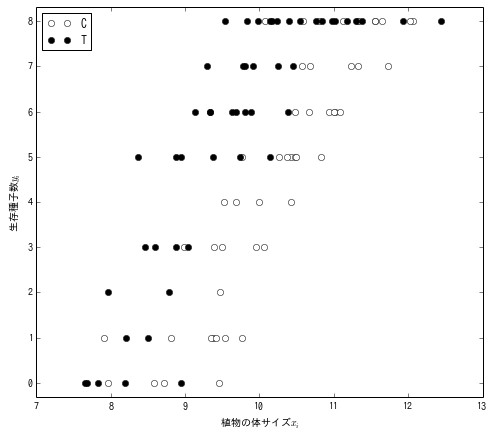
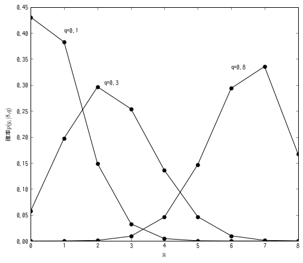
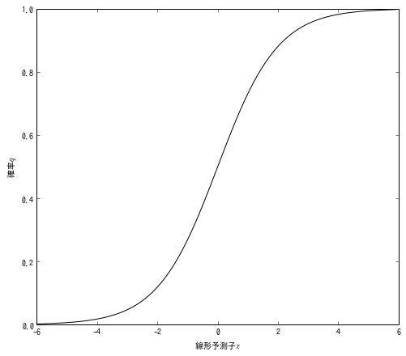
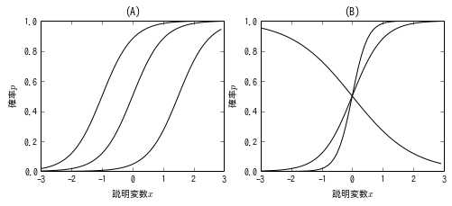
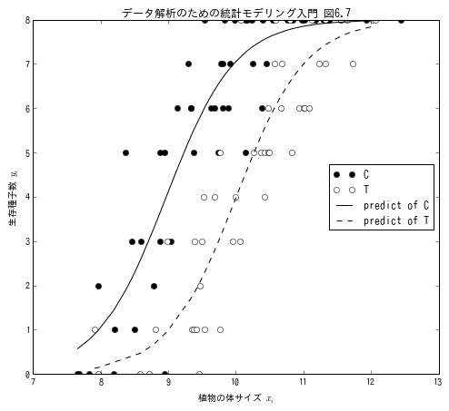
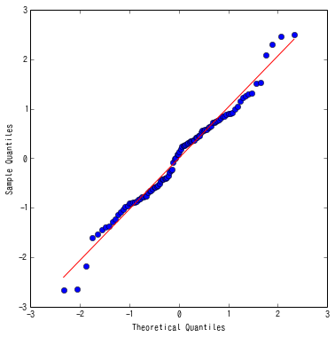
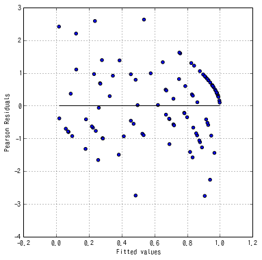
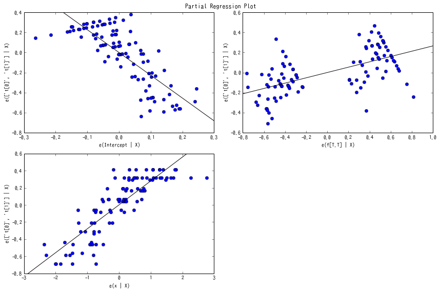
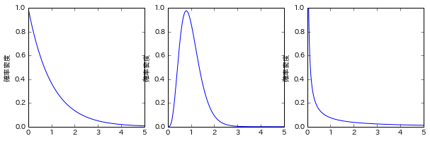
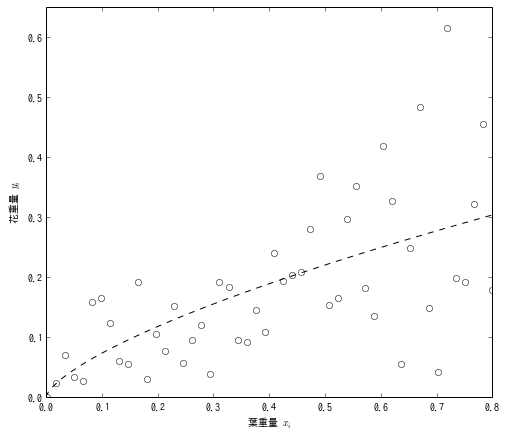

第6章 GLMの応用範囲をひろげる
=============================

.. code:: python

    import pandas
    
    src = "http://hosho.ees.hokudai.ac.jp/~kubo/stat/iwanamibook/fig/binomial/data4a.csv"
    
    def fetch_data(src):
        return pandas.read_csv(src)
.. code:: python

    def setLimit(endog):
        (m, M) = endog.min(), endog.max()
        delta = (M - m)/25.
        ylim(m-delta, M+delta)
        return
6.2 例題：上限のあるカウントデータ
----------------------------------

図6.2

.. code:: python

    def draw_fig_6_2():
        """
        図3.2を描画する関数
        """
        df = fetch_data(src)
        scatterPlot(df, 'y', 'x', 'f')
        xlabel(u"植物の体サイズ$x_i$")
        ylabel(u"生存種子数$y_i$")
        return
    
    def scatterPlot(df, name_y, name_x, name_c):
        """
        matplotlibを用いたScatterPlotのようなもの
        """
        catg = df[name_c].unique()
        data = [df[df[name_c] == c][[name_y, name_x]] for c in catg]
        syms = ['wo', 'ko']
        for i in xrange(len(catg)):
            plot(data[i][name_x], data[i][name_y], syms[i],label=catg[i])
        setLimit(df['y'])
        legend(loc='upper left')
        return
.. code:: python

    figure(figsize(8, 7))
    draw_fig_6_2()
    plt.show()

6.3 二項分布で表現する「あり・なし」カウントデータ
--------------------------------------------------

.. code:: python

    from scipy import stats
    
    def draw_fig_6_3():
        xx = np.arange(0, 9)
        qs = [0.1, 0.3, 0.8]
        [plot(xx, stats.binom.pmf(xx, 8, q), 'ko-') for q in qs]
        xlabel(u"$y_i$")
        ylabel(u"確率$p(y_i|8,q)$")
        text(1,0.40,u"q=0.1")
        text(2.2,0.3, u"q=0.3")
        text(6,0.33, u"q=0.8")
        plt.show()
.. code:: python

    figure(figsize(8, 7))
    draw_fig_6_3()
    plt.show()

6.4 ロジスティック回帰とロジットリンク関数
------------------------------------------

図6.4

.. code:: python

    # データ解析のための統計モデリング入門 pp.120
    def my_logistic_function(z):
        return 1./(1. + np.exp(-z))
    
    def draw_fig_6_4():
        xx = np.arange(-6, 6, 0.1)
        plot(xx, my_logistic_function(xx), 'k-')
        ylabel(u"確率$q$")
        xlabel(u"線形予測子$z$")
        return
.. code:: python

    figure(figsize(8, 7))
    draw_fig_6_4()
    plt.show()  

.. code:: python

    def draw_fig_6_5():
        xx = np.arange(-3, 3, 0.1)
    
        L1 = [(0, 2), (2, 2), (-3, 2)]
        L2 = [(0, 2), (0, 4), (0, -1)]
    
        plt = subplot(121)
        for beta1, beta2 in L1:
            plt.plot(xx, my_logistic_function(beta1+beta2*xx), 'k-')
        xlabel(u"説明変数$x$")
        ylabel(u"確率$p$")
        title("(A)")
        
        plt = subplot(122)
        for beta1, beta2 in L2:
            plt.plot(xx, my_logistic_function(beta1+beta2*xx), 'k-')
        xlabel(u"説明変数$x$")
        ylabel(u"確率$p$")
        title("(B)")
.. code:: python

    figure(figsize(8, 3))
    draw_fig_6_5()
    plt.show()

.. code:: python

    import statsmodels.api as sm
    from statsmodels.formula.api import glm
    
    def get_mdl_4():
        """
        In the book,
        Intercept: -19.536
        x: 1.952
        fT: 2.022
        LogLik: -133.1 (df=2)
        """
        df = fetch_data(src)
        t = zip(df['y'].values, 8 - df['y'].values)
        mdl = glm('t ~ x + f', data=df, family = sm.families.Binomial(link=sm.families.links.logit)).fit()
        print mdl.summary()
        return mdl
    
    mdl_4 = get_mdl_4()

.. parsed-literal::

                     Generalized Linear Model Regression Results                  
    ==============================================================================
    Dep. Variable:       ['t[0]', 't[1]']   No. Observations:                  100
    Model:                            GLM   Df Residuals:                       97
    Model Family:                Binomial   Df Model:                            2
    Link Function:                  logit   Scale:                             1.0
    Method:                          IRLS   Log-Likelihood:                -133.11
    Date:                Mon, 21 Oct 2013   Deviance:                       123.03
    Time:                        08:49:46   Pearson chi2:                     109.
    No. Iterations:                     7                                         
    ==============================================================================
                     coef    std err          t      P>|t|      [95.0% Conf. Int.]
    ------------------------------------------------------------------------------
    Intercept    -19.5361      1.414    -13.818      0.000       -22.307   -16.765
    f[T.T]         2.0215      0.231      8.740      0.000         1.568     2.475
    x              1.9524      0.139     14.059      0.000         1.680     2.225
    ==============================================================================

図6.7

.. code:: python

    def draw_figure_6_7(model):
        DF = fetch_data(src)
        DF = DF.sort(columns=['x'])
        
        Y_ = model.predict(DF) * 8
        
        mask = (DF['f'] == 'T')
        plt.plot(DF[mask]['x'], DF[mask]['y'], 'ok', label="C")
        mask = (DF['f'] == 'C')
        plt.plot(DF[mask]['x'], DF[mask]['y'], 'ow', label="T")
        
        mask = (DF['f'] == 'T')
        plt.plot(DF[mask]['x'], Y_[mask], '-k', label="predict of C")
        mask = (DF['f'] == 'C')
        plt.plot(DF[mask]['x'], Y_[mask], '--k', label="predict of T")
        
        legend(loc="right")
        title(u"データ解析のための統計モデリング入門 図6.7")
        ylabel(u"生存種子数 $y_i$")
        xlabel(u"植物の体サイズ $x_i$")
.. code:: python

    figure(figsize(8, 7))
    draw_figure_6_7(mdl_4)
    plt.show()

.. code:: python

    def my_qqplot(model):
        # Q-Q Plot
        resid = model.resid_pearson
        sm.graphics.qqplot(resid, fit=True, line='r')
    
    def my_fit_vs_res(model):
        # fitted vs. residual Plot
        resid = model.resid_pearson
        scatter(model.mu, resid)
        hlines(0, model.mu.min(), model.mu.max())
        ylabel('Pearson Residuals')
        xlabel('Fitted values')
        grid()
.. code:: python

    figure(figsize(6, 6))
    my_qqplot(mdl_4)
    plt.show()

.. parsed-literal::

    <matplotlib.figure.Figure at 0x7e35b10>

.. code:: python

    figure(figsize(6, 6))
    my_fit_vs_res(mdl_4)
    plt.show()

.. code:: python

    # fitted vs. residual Plot
    fig = plt.figure(figsize=(12,8))
    fig = sm.graphics.plot_partregress_grid(mdl_4, fig=fig)

6.8 ガンマ分布のGLM
-------------------

.. code:: python

    import os
    import urllib
    import pandas
    import pandas.rpy.common as com
    
    def fetch_rdata():
        src = "http://hosho.ees.hokudai.ac.jp/~kubo/stat/iwanamibook/fig/gamma/d.RData"
        urllib.urlretrieve(src, './d.RData')
        ret = com.load_data('d')
        os.remove('./d.RData')
        return ret
.. code:: python

    from scipy.stats import gamma
    
    def plot_gamma(shape, rate):
        """
        scipyのgamma関数はRのdgammaとパラメータが異なる．
        dgammaはshapeとrateを取るが，
        scipy.stats.gammaはshapeと分散(shape/rate^2)をとる．
        """
        N = 1000
        x = linspace(0, 5, N)
        scale = shape/(rate**2)
        y = gamma.pdf(x, [shape], scale=scale)
        plot(x, y)
        ylabel(u"確率密度")
        
    def draw_figure_6_12():
        subplot(131)
        plot_gamma(1.,1.)
        subplot(132)
        plot_gamma(5.,5.)
        subplot(133)
        plot_gamma(.1, .1)
        xlim(0, 5)
        ylim(0, 1.0)
.. code:: python

    figure(figsize(10, 3))
    draw_figure_6_12()
    plt.show()

.. code:: python

    import statsmodels.api as sm
    from statsmodels.formula.api import glm
    
    def get_mdl_5():
        df = fetch_rdata()
        mdl = glm('y ~ log(x)', df, family = sm.families.Gamma(link=sm.families.links.log)).fit()
        print mdl.summary()
        return mdl
    
    mdl_5 = get_mdl_5()

.. parsed-literal::

                     Generalized Linear Model Regression Results                  
    ==============================================================================
    Dep. Variable:                      y   No. Observations:                   50
    Model:                            GLM   Df Residuals:                       48
    Model Family:                   Gamma   Df Model:                            1
    Link Function:                    log   Scale:                  0.325084553223
    Method:                          IRLS   Log-Likelihood:                 58.471
    Date:              月, 21 10月 2013   Deviance:                       17.251
    Time:                        09:00:04   Pearson chi2:                     15.6
    No. Iterations:                    11                                         
    ==============================================================================
                     coef    std err          t      P>|t|      [95.0% Conf. Int.]
    ------------------------------------------------------------------------------
    Intercept     -1.0403      0.119     -8.759      0.000        -1.273    -0.808
    log(x)         0.6832      0.068      9.992      0.000         0.549     0.817
    ==============================================================================

.. code:: python

    def draw_fig_6_13(mdl):
        DF = fetch_rdata()
        df = DF.sort(columns=['x'])
        xx = df['x']
        yy = df['y']
        x_ = pandas.DataFrame({'x':np.linspace(0, 0.8, 1000)})
        y_ = mdl.predict(x_)
        plot(xx, yy, 'ow')
        plot(x_, y_,'--k')
        ylabel(u"花重量 $y_i$")
        xlabel(u"葉重量 $x_i$")
        xlim(0, 0.8)
        ylim(0, 0.65)
.. code:: python

    figure(figsize(8, 7))
    draw_fig_6_13(mdl_5)
    plt.show()

