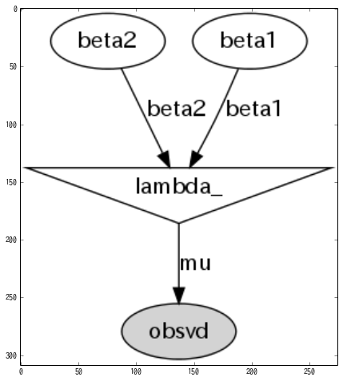
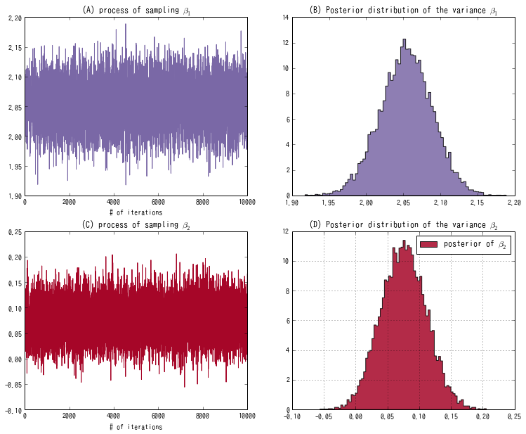
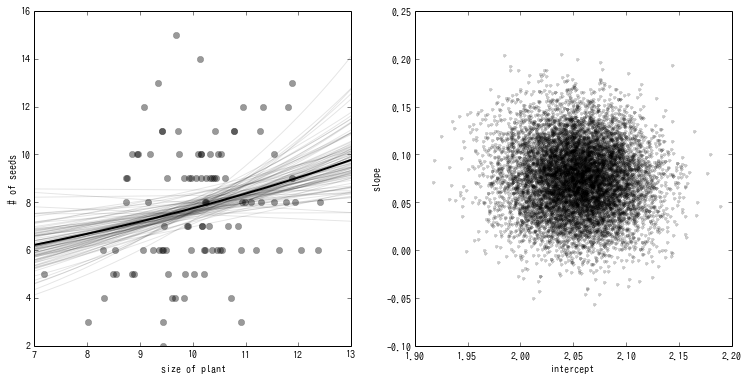

第9章 GLMのベイズモデル化と事後分布の推定
=========================================

9.4 ベイズ統計モデルの事後分布の推定
------------------------------------

.. code:: python

    import pymc
    import numpy
    import pandas

.. parsed-literal::

    Couldn't import dot_parser, loading of dot files will not be possible.

.. code:: python

    import pandas
    
    src = "http://hosho.ees.hokudai.ac.jp/~kubo/stat/iwanamibook/fig/poisson/data3a.csv"
    
    def fetch_data(src):
        return pandas.read_csv(src)
.. code:: python

    data = fetch_data(src)
    X = data['x'].values
    Y = data['y'].values
.. code:: python

    # P190のBUGSコードに相当する
    beta1 = pymc.Normal("beta1", mu=0, tau=1.0e-3)
    beta2 = pymc.Normal("beta2", mu=0, tau=1.0e-3)
    
    @pymc.deterministic
    def lambda_(X=X, beta1=beta1, beta2=beta2):
        return np.exp(beta1 + beta2*(X - X.mean()))
    
    #X.mean()で引かないと収束まですごく時間がかかってしまう。
    
    obsvd = pymc.Poisson("obsvd", mu=lambda_, value=Y, observed=True)
    model = pymc.Model([beta1, beta2, obsvd])
.. code:: python

    # グラフィカルモデルの描画
    # require pydot and graphviz
    import pydot
    import scipy.misc
    
    pymc.graph.graph(model, format='png', path='',name='model',prog='dot')
    figure(figsize=(8, 8))
    imshow(imread('model.png'))

.. parsed-literal::

    <matplotlib.image.AxesImage at 0x4a18bd0>

.. code:: python

    mcmc = pymc.MCMC(model)
    mcmc.sample(iter=105000, burn=5000, thin=10)

.. parsed-literal::

     
[****************100%******************]  105000 of 105000 complete

.. code:: python

    def draw_figure_9_5(mcmc):
        beta1_samples = mcmc.trace('beta1')[:, None]
        beta2_samples = mcmc.trace('beta2')[:, None]
        
        figsize(12.5, 10)
        plt.subplot(221)
        plt.title(r"(A) process of sampling $\beta_1$")
        plt.plot(beta1_samples, c="#7A68A6", lw=1)
        plt.xlabel('# of iterations')
        
        plt.subplot(222)
        plt.title(r"(B) Posterior distribution of the variance $\beta_1$")
        plt.hist(beta1_samples, histtype='stepfilled', bins=80, alpha=0.85,
                 label=r"posterior of $\beta_1$", color="#7A68A6", normed=True)
        
        plt.subplot(223)
        plt.title(r"(C) process of sampling $\beta_2$")
        plt.plot(beta2_samples, c="#A60628", lw=1)
        plt.xlabel('# of iterations')
        
        plt.subplot(224)
        plt.title(r"(D) Posterior distribution of the variance $\beta_2$")
        plt.hist(beta2_samples, histtype='stepfilled', bins=80, alpha=0.85,
                 label=r"posterior of $\beta_2$", color="#A60628", normed=True)
        plt.legend()
        grid()
.. code:: python

    figsize(12.5, 12.5)
    draw_figure_9_5(mcmc)
    plt.show()

.. code:: python

    def draw_figure_9_6(mcmc):
        beta1_samples = mcmc.trace('beta1')[:, None]
        beta2_samples = mcmc.trace('beta2')[:, None]
        N = 1000
        M = 100
        b1s = beta1_samples[:]
        b2s = beta2_samples[:]
        
        ###
        plt.subplot(121)
        plt.plot(X, Y, 'ko', alpha=0.4)
        xx = np.linspace(7, 13, N)
        yy = np.exp(b1s + ((xx - X.mean()).T * b2s)) # ここポイント!!
        
        [plt.plot(xx, yy[i], 'k-', alpha=0.1) for i in numpy.random.randint(0, len(b1s), M)]
        plt.plot(xx, yy.mean(axis=0), 'k-', lw=2)
        plt.xlabel(u"size of plant")
        plt.ylabel(u"# of seeds")
        
        ###
        plt.subplot(122)
        plt.plot(b1s, b2s, 'k.', alpha=0.2)
        plt.xlabel(u"intercept")
        plt.ylabel(u"slope")
.. code:: python

    figsize(12.5, 6)
    draw_figure_9_6(mcmc)
    plt.show()

.. code:: python

    b1s = mcmc.trace('beta1')[:, None]
    b2s = mcmc.trace('beta2')[:, None]
    result = pandas.DataFrame({'beta1':b1s.flatten(), 'beta2':b2s.flatten()})
    result.describe(percentile_width=50)

.. raw:: html

    

    <table border="1" class="dataframe">
      <thead>
        <tr style="text-align: right;">
          <th></th>
          <th>beta1</th>
          <th>beta2</th>
        </tr>
      </thead>
      <tbody>
        <tr>
          <th>count</th>
          <td> 10000.000000</td>
          <td> 10000.000000</td>
        </tr>
        <tr>
          <th>mean</th>
          <td>     2.053989</td>
          <td>     0.075660</td>
        </tr>
        <tr>
          <th>std</th>
          <td>     0.035214</td>
          <td>     0.035872</td>
        </tr>
        <tr>
          <th>min</th>
          <td>     1.917714</td>
          <td>    -0.055884</td>
        </tr>
        <tr>
          <th>25%</th>
          <td>     2.030635</td>
          <td>     0.050805</td>
        </tr>
        <tr>
          <th>50%</th>
          <td>     2.054269</td>
          <td>     0.075583</td>
        </tr>
        <tr>
          <th>75%</th>
          <td>     2.077592</td>
          <td>     0.100005</td>
        </tr>
        <tr>
          <th>max</th>
          <td>     2.188798</td>
          <td>     0.205516</td>
        </tr>
      </tbody>
    </table>
    

.. code:: python

    