10 階層ベイズモデル
===================

10.3.1 階層ベイズモデルのMCMCサンプリング
-----------------------------------------

.. code:: python

    import pymc
    import numpy
    import pandas
    import scipy

.. parsed-literal::

    Couldn't import dot_parser, loading of dot files will not be possible.

.. code:: python

    import pandas
    
    src = "http://hosho.ees.hokudai.ac.jp/~kubo/stat/iwanamibook/fig/hbm/data7a.csv"
    
    def fetch_data(src):
        return pandas.read_csv(src)
.. code:: python

    # fig 10.1(B)
    def draw_figure_10_1():
        df = fetch_data(src)
        hist(df['y'], bins=9, color='w')
        xx = linspace(0, 8, 9)
        yy = scipy.stats.binom.pmf(xx, 8, 0.504) * 100
        plot(xx, yy, 'ko-')
.. code:: python

    figure(figsize(8,7))
    draw_figure_10_1()
    plt.show()

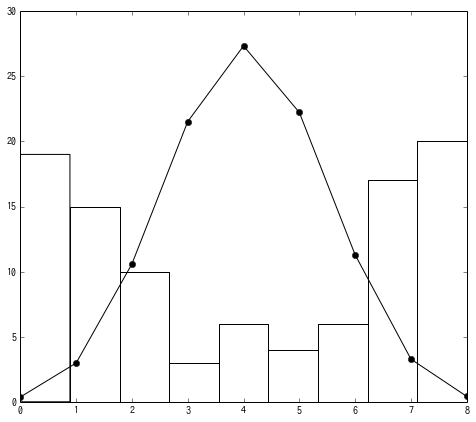

.. code:: python

    df = fetch_data(src)
.. code:: python

    ### pp.228のBUGSコード相当
    Y = df['y'].values
    N = len(Y)
    
    ### hyperpriors
    s = pymc.Uniform(name="s", lower=1.0e-2, upper=1.0e+2, value=0.01)
    b = pymc.Normal(name='b', mu=0.01, tau=1.0e+2)
    
    ### priors
    r = [pymc.Normal(name="r_{0}".format(i), mu=0., tau=s**-2) for i in range(N)]
    p = pymc.Lambda('p', lambda r=r, b=b: pymc.invlogit(b + r))
    
    obs = pymc.Binomial(name="obs", n=8, p=p, value=Y, observed=True)
    model = pymc.Model([b, s, obs])
.. code:: python

    # かなり時間がかかるので実行時には注意すること！
    mcmc = pymc.MCMC(model)
    mcmc.sample(iter=10000, burn=1000, thin=10)

.. parsed-literal::

     
[****************100%******************]  10000 of 10000 complete

.. code:: python

    # サンプリング過程の可視化
    pymc.Matplot.plot(mcmc.trace("b"), common_scale=False)

.. parsed-literal::

    Plotting b

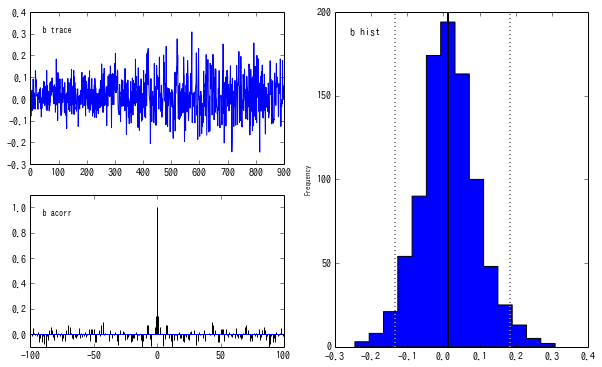

.. code:: python

    # サンプリング過程の可視化
    pymc.Matplot.plot(mcmc.trace("s"), common_scale=False)

.. parsed-literal::

    Plotting s

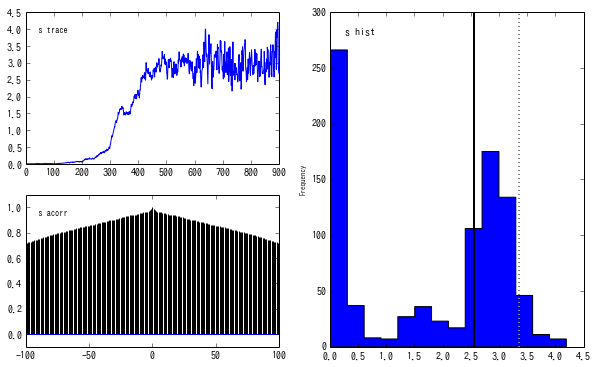

.. code:: python

    # サンプリング過程の可視化
    pymc.Matplot.plot(mcmc.trace("r_0"), common_scale=False)

.. parsed-literal::

    Plotting r_0

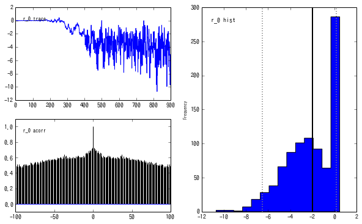

.. code:: python

    # グラフィカルモデルの可視化
    import pydot
    import scipy.misc
    
    pymc.graph.graph(model, format='png', path='',name='model',prog='dot')
    figure(figsize=(100,100))
    imshow(imread('model.png'))

.. parsed-literal::

    <matplotlib.image.AxesImage at 0xb54c310>

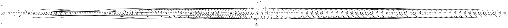

.. code:: python

    # 大体600回目くらいからうまくサンプリングできていそう。
    left = 600
    
    L = []
    b_= numpy.mean(mcmc.trace('b')[:, None].T[0][left:])
    
    for i in range(N):
        ri = numpy.mean(mcmc.trace('r_{0}'.format(i))[:, None].T[0][left:])
        L.append(pymc.binomial_expval(n=8, p=pymc.invlogit(b_+ri)))
.. code:: python

    Befor = hist(df['y'], bins=9, color='b', range=(0, 8))[0]
    After = hist(L, bins=9, color='w', range=(0, 8))[0]

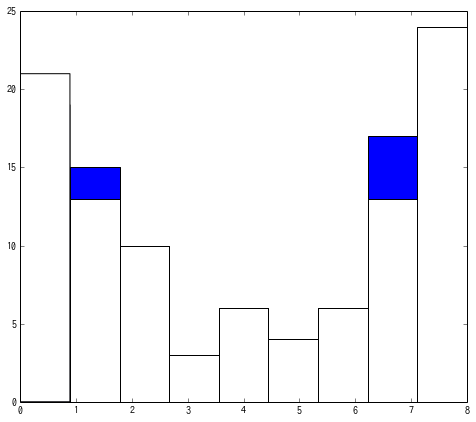

.. code:: python

    xx = linspace(0, 8, 9)
    plot(xx, After, 'ro--')
    plot(xx, Befor, 'bo')

.. parsed-literal::

    [<matplotlib.lines.Line2D at 0x4fce290>]

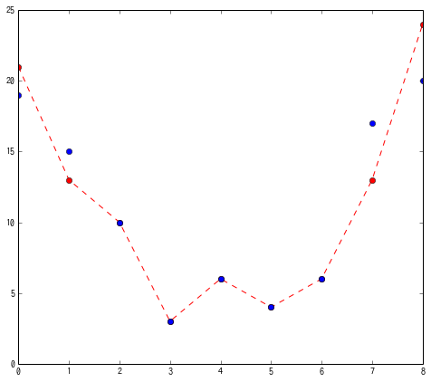

10.5 個体差+場所差の階層ベイズモデル
------------------------------------

.. code:: python

    import pandas
    
    src = "http://hosho.ees.hokudai.ac.jp/~kubo/stat/iwanamibook/fig/hbm/nested/d1.csv"
    
    def fetch_data(src):
        return pandas.read_csv(src)
.. code:: python

    df = fetch_data(src)
    N_smp = len(df)
    N_pot = len(df['pot'].unique())
.. code:: python

    # 施肥処理に関して
    df['F'] = 0
    df['F'][(df['f'] == 'T')] = 1
    _F = df['F'].values
.. code:: python

    # ポット種類に関して
    df['P'] = 0
    d = dict(zip(df['pot'].unique(), xrange(N_pot)))
    df['P'] = df['pot'].map(lambda x: d[x])
    _P = df['P'].values
.. code:: python

    # 観測値に関して
    Y = df['y'].values
モデルを作成

.. code:: python

    ### hyperpriors
    _b1 = pymc.Normal("b1", mu=0, tau=1.0e+2, value=0.01)
    _b2 = pymc.Normal("b2", mu=0, tau=1.0e+2, value=0.01)
    _s1 = pymc.Uniform("s1", 0, 3*1.0e+2, value=0.01)
    _s2 = pymc.Uniform("s2", 0, 3*1.0e+2, value=0.01)
    
    ### priors
    _rs = [pymc.Normal(name="rs_{0}".format(i), mu=0, tau=_s1**-2) for i in range(N_smp)]
    _rp = [pymc.Normal(name="rp_{0}".format(i), mu=0, tau=_s2**-2) for i in range(N_pot)]
    
    @pymc.deterministic
    def p(b1=_b1, b2=_b2, rs=_rs, rp=_rp, F=_F, P=_P):
        L = []
        for i in xrange(N_smp):
            v = np.exp(b1 + b2*F[i] + rs[i] + rp[P[i]])
            L.append(v)
        return numpy.asarray(L)
.. code:: python

    obs = pymc.Poisson("obs", mu=p, value=Y, observed=True)
    model = pymc.Model([_b1, _b2, _s1, _s2, obs])
.. code:: python

    #すごく時間がかかるので注意（pymc3からは高速化される）
    mcmc = pymc.MCMC(model)
    mcmc.sample(iter=10000, burn=1000, thin=10)

.. parsed-literal::

     
[****************100%******************]  10000 of 10000 complete

.. code:: python

    # サンプリング過程の可視化
    pymc.Matplot.plot(mcmc.trace("b1"), common_scale=False)

.. parsed-literal::

    Plotting b1

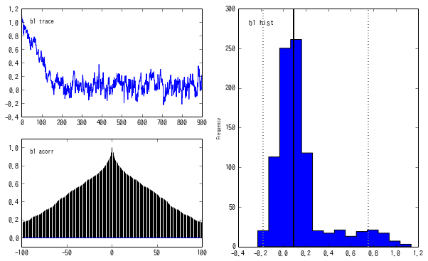

.. code:: python

    # サンプリング過程の可視化
    pymc.Matplot.plot(mcmc.trace("b2"), common_scale=False)

.. parsed-literal::

    Plotting b2

.. image:: Chapter10_files/Chapter10_27_1.png

.. code:: python

    # サンプリング過程の可視化
    pymc.Matplot.plot(mcmc.trace("s1"), common_scale=False)

.. parsed-literal::

    Plotting s1

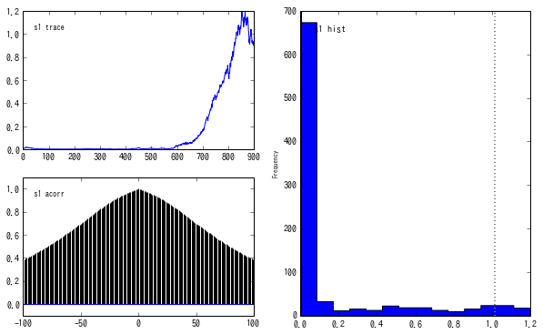

.. code:: python

    # サンプリング過程の可視化
    pymc.Matplot.plot(mcmc.trace("s2"), common_scale=False)

.. parsed-literal::

    Plotting s2

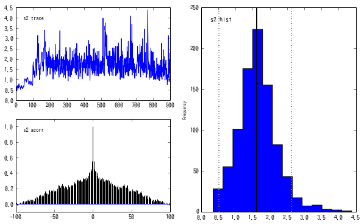

.. code:: python

    b1 = numpy.mean(mcmc.trace('b1')[:, None].T[0])
    b2 = numpy.mean(mcmc.trace('b1')[:, None].T[0])
    s1 = numpy.mean(mcmc.trace('s1')[:, None].T[0])
    s2 = numpy.mean(mcmc.trace('s2')[:, None].T[0])
.. code:: python

    l_rs = []
    for i in range(N_smp):
        t_rs = numpy.mean(mcmc.trace('rs_{0}'.format(i))[:, None].T[0])
        l_rs.append(t_rs)
    
    l_rp = []
    for i in range(N_pot):
        t_rp = numpy.mean(mcmc.trace('rp_{0}'.format(i))[:, None].T[0])
        l_rp.append(t_rp)
.. code:: python

    l_out = []
    for i in xrange(N_smp):
        v = np.exp(b1 + b2 * 0 + l_rs[i] + l_rp[0])
        l_out.append(v)
.. code:: python

    import pydot
    import scipy.misc
    
    pymc.graph.graph(model, format='png', path='',name='model',prog='dot')
    figure(figsize=(100,100))
    imshow(imread('model.png'))

.. parsed-literal::

    <matplotlib.image.AxesImage at 0xf774d90>

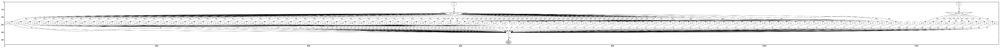

