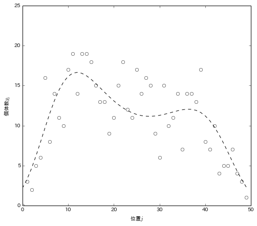
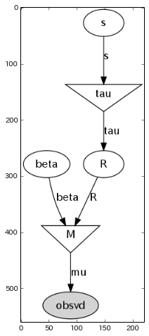
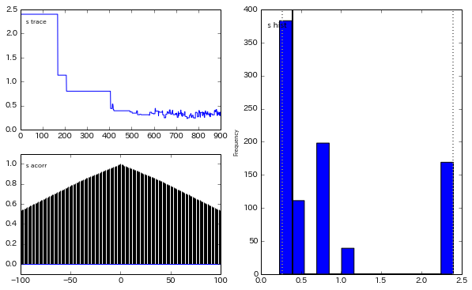
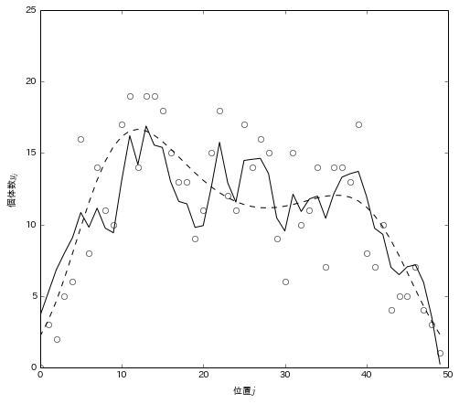
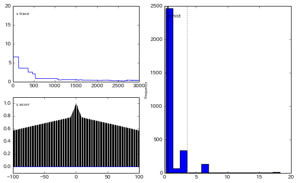
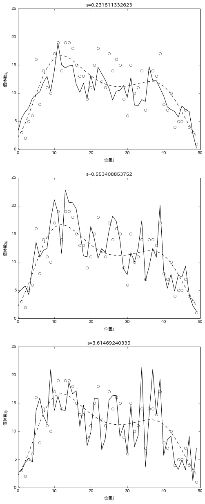

第11章 空間構造のある階層ベイズモデル
=====================================

Intrinsic CARモデルについては下記サイトを参考にしました。
http://glau.ca/?p=340

.. code:: python

    import pymc
    import numpy
    import pandas
    import scipy

.. parsed-literal::

    Couldn't import dot_parser, loading of dot files will not be possible.

.. parsed-literal::

    /home/youki/.virtualenvs/apple/local/lib/python2.7/site-packages/pytz/__init__.py:31: UserWarning: Module readline was already imported from /home/youki/.virtualenvs/apple/lib/python2.7/lib-dynload/readline.x86_64-linux-gnu.so, but /home/youki/.virtualenvs/apple/lib/python2.7/site-packages is being added to sys.path
      from pkg_resources import resource_stream

11.1 例題：一次元空間上の個体数分布
-----------------------------------

.. code:: python

    import os
    import urllib
    import pandas
    import pandas.rpy.common as com
    
    def fetch_rdata():
        src = "http://hosho.ees.hokudai.ac.jp/~kubo/stat/iwanamibook/fig/spatial/Y.RData"
        if (not os.path.exists('data')):
            os.makedirs('data')
        urllib.urlretrieve(src, 'data/Y.RData')
        ret = pandas.DataFrame({'Y':com.load_data('Y'), 'm':com.load_data('m')})
        return ret
.. code:: python

    def draw_figure_11_2():
        df = fetch_rdata()
        xx = range(len(df))
        y1 = df['Y'].values
        y2 = df['m'].values
        plot(xx, y1, 'ow')
        plot(xx, y2, 'k--')
        xlabel(u"位置$j$")
        ylabel(u"個体数$y_j$")
        ylim(0, 25)
        return
.. code:: python

    figure(figsize(8,7))
    draw_figure_11_2()
    plt.show()

11.3 空間統計モデルをデータにあてはめる
---------------------------------------

.. code:: python

    N = 50
    
    # 観測ベクトル
    Y = fetch_rdata()['Y'].values
    
    # 隣接ベクトル(muの計算に用いる)
    a1 = np.arange(N)
    a2 = map(list, zip(a1-1, a1+1))
    a2[0] = [1]
    a2[-1] = [49]
    A = np.asarray(a2)
    
    # 重みベクトル(muの計算に用いる)
    W = np.asarray(map(lambda x: [x**(-1)]*x, map(len, A)))
    
    # n_jベクトル(sigmaの計算に用いる)
    Wplus = array([len(w) for w in W])
.. code:: python

    Y

.. parsed-literal::

    array([  0.,   3.,   2.,   5.,   6.,  16.,   8.,  14.,  11.,  10.,  17.,
            19.,  14.,  19.,  19.,  18.,  15.,  13.,  13.,   9.,  11.,  15.,
            18.,  12.,  11.,  17.,  14.,  16.,  15.,   9.,   6.,  15.,  10.,
            11.,  14.,   7.,  14.,  14.,  13.,  17.,   8.,   7.,  10.,   4.,
             5.,   5.,   7.,   4.,   3.,   1.])

.. code:: python

    A

.. parsed-literal::

    array([[1], [0, 2], [1, 3], [2, 4], [3, 5], [4, 6], [5, 7], [6, 8], [7, 9],
           [8, 10], [9, 11], [10, 12], [11, 13], [12, 14], [13, 15], [14, 16],
           [15, 17], [16, 18], [17, 19], [18, 20], [19, 21], [20, 22],
           [21, 23], [22, 24], [23, 25], [24, 26], [25, 27], [26, 28],
           [27, 29], [28, 30], [29, 31], [30, 32], [31, 33], [32, 34],
           [33, 35], [34, 36], [35, 37], [36, 38], [37, 39], [38, 40],
           [39, 41], [40, 42], [41, 43], [42, 44], [43, 45], [44, 46],
           [45, 47], [46, 48], [47, 49], [49]], dtype=object)

.. code:: python

    W

.. parsed-literal::

    array([[1.0], [0.5, 0.5], [0.5, 0.5], [0.5, 0.5], [0.5, 0.5], [0.5, 0.5],
           [0.5, 0.5], [0.5, 0.5], [0.5, 0.5], [0.5, 0.5], [0.5, 0.5],
           [0.5, 0.5], [0.5, 0.5], [0.5, 0.5], [0.5, 0.5], [0.5, 0.5],
           [0.5, 0.5], [0.5, 0.5], [0.5, 0.5], [0.5, 0.5], [0.5, 0.5],
           [0.5, 0.5], [0.5, 0.5], [0.5, 0.5], [0.5, 0.5], [0.5, 0.5],
           [0.5, 0.5], [0.5, 0.5], [0.5, 0.5], [0.5, 0.5], [0.5, 0.5],
           [0.5, 0.5], [0.5, 0.5], [0.5, 0.5], [0.5, 0.5], [0.5, 0.5],
           [0.5, 0.5], [0.5, 0.5], [0.5, 0.5], [0.5, 0.5], [0.5, 0.5],
           [0.5, 0.5], [0.5, 0.5], [0.5, 0.5], [0.5, 0.5], [0.5, 0.5],
           [0.5, 0.5], [0.5, 0.5], [0.5, 0.5], [1.0]], dtype=object)

.. code:: python

    Wplus

.. parsed-literal::

    array([1, 2, 2, 2, 2, 2, 2, 2, 2, 2, 2, 2, 2, 2, 2, 2, 2, 2, 2, 2, 2, 2, 2,
           2, 2, 2, 2, 2, 2, 2, 2, 2, 2, 2, 2, 2, 2, 2, 2, 2, 2, 2, 2, 2, 2, 2,
           2, 2, 2, 1])

.. code:: python

    ### hyper priors
    beta = pymc.Normal('beta', mu=0, tau=1.0e-4)
    s = pymc.Uniform('s', lower=0, upper=1.0e+4)
    tau = pymc.Lambda('tau', lambda s=s: s**(-2))
    
    ### Intrinsic CAR
    @pymc.stochastic
    def R(tau=tau, value=np.zeros(N)):
        # Calculate mu based on average of neighbors
        mu = np.array([sum(W[i]*value[A[i]])/Wplus[i] for i in xrange(N)])
        
        # Scale precision to the number of neighbors
        taux = tau*Wplus
        return pymc.normal_like(value, mu, taux)
    
    @pymc.deterministic
    def M(beta=beta, R=R):
        return [np.exp(beta + R[i]) for i in xrange(N)]
    
    obsvd = pymc.Poisson("obsvd", mu=M, value=Y, observed=True)
    model = pymc.Model([s, beta, obsvd])
.. code:: python

    # グラフィカルモデルの描画
    # require pydot and graphviz
    import pydot
    import scipy.misc
    
    pymc.graph.graph(model, format='png', path='',name='model',prog='dot')
    figure(figsize=(8, 8))
    imshow(imread('model.png'))

.. parsed-literal::

    <matplotlib.image.AxesImage at 0x5fed850>

.. code:: python

    mcmc = pymc.MCMC(model)
    mcmc.sample(iter=10000, burn=1000, thin=10)

.. parsed-literal::

     
[****************100%******************]  10000 of 10000 complete

.. code:: python

    # サンプリング過程の可視化
    pymc.Matplot.plot(mcmc.trace("beta"), common_scale=False)

.. parsed-literal::

    Plotting beta

.. image:: Chapter11_files/Chapter11_16_1.png

.. code:: python

    # サンプリング過程の可視化
    pymc.Matplot.plot(mcmc.trace("s"), common_scale=False)

.. parsed-literal::

    Plotting s

.. code:: python

    def draw_figure_11_4(burnin=0):
        b = np.mean(mcmc.trace('beta')[burnin:, None].flatten())
        R = np.mean(mcmc.trace("R")[burnin:, None], axis=0).flatten()
        xx = np.arange(N)
        yy = np.exp(b + R)
        draw_figure_11_2()
        plot(xx, yy, 'k-')
        return
.. code:: python

    figure(figsize(8,7))
    draw_figure_11_4(burnin = 700) #betaやsの振る舞いが安定してきたあたりをburninに設定.
    plt.show()

:math:`\beta`\ =2.27 に固定する

.. code:: python

    ### hyper priors
    beta = 2.27
    s = pymc.Uniform('s', lower=0, upper=1.0e+4)
    tau = pymc.Lambda('tau', lambda s=s: s**(-2))
    
    ### Intrinsic CAR
    @pymc.stochastic
    def R(tau=tau, value=np.zeros(N)):
        # Calculate mu based on average of neighbors
        mu = np.array([sum(W[i]*value[A[i]])/Wplus[i] for i in xrange(N)])
        
        # Scale precision to the number of neighbors
        taux = tau*Wplus
        return pymc.normal_like(value, mu, taux)
    
    @pymc.deterministic
    def M(beta=beta, R=R):
        return [np.exp(beta + R[i]) for i in xrange(N)]
    
    obsvd = pymc.Poisson("obsvd", mu=M, value=Y, observed=True)
    model = pymc.Model([s, beta, obsvd])
    
    mcmc = pymc.MCMC(model)
    mcmc.sample(iter=10000, burn=1000, thin=3)

.. parsed-literal::

     
[****************100%******************]  10000 of 10000 complete

.. code:: python

    # サンプリング過程の可視化
    pymc.Matplot.plot(mcmc.trace("s"), common_scale=False)

.. parsed-literal::

    Plotting s

.. code:: python

    def draw_figure_11_5(burnin=0):
        s = mcmc.trace('s')[burnin:, None].flatten()
        S = [min(s), median(s), percentile(s, 95)]
        L = list(s)
        I = [L.index(_s) for _s in S]
        R = [mcmc.trace('R')[burnin:, None][i].flatten() for i in I]
    
        figure(figsize(8, 21))
        beta = 2.27
        xx = np.arange(N)
        P = [311, 312, 313]
        for i in xrange(3):
            subplot(P[i])
            draw_figure_11_2()
            plot(xx, np.exp(beta+R[i]), 'k-')
            title("s={0}".format(S[i]))
.. code:: python

    draw_figure_11_5(burnin=0)

11.5 空間相関モデルと欠測のある観測データ
-----------------------------------------

car.normalの実装を確認しなきゃかけなそうなので、ここは時間があったらやります。
